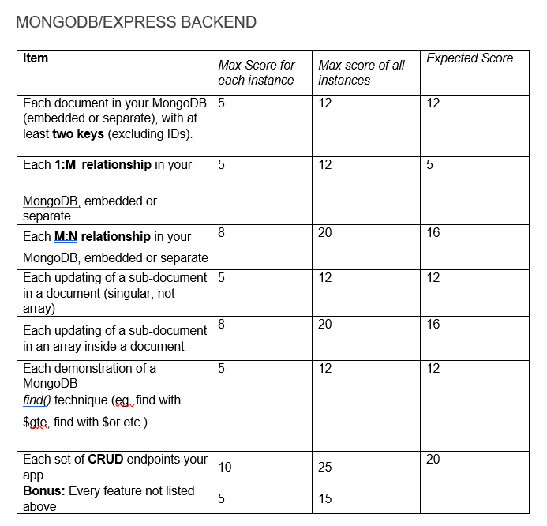
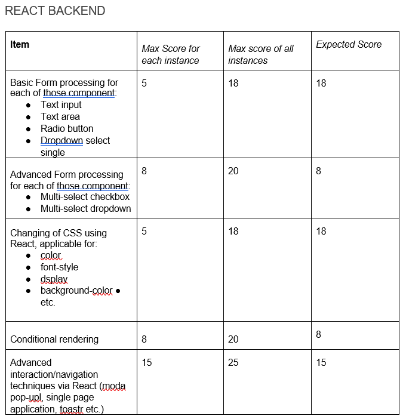
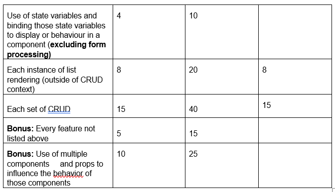
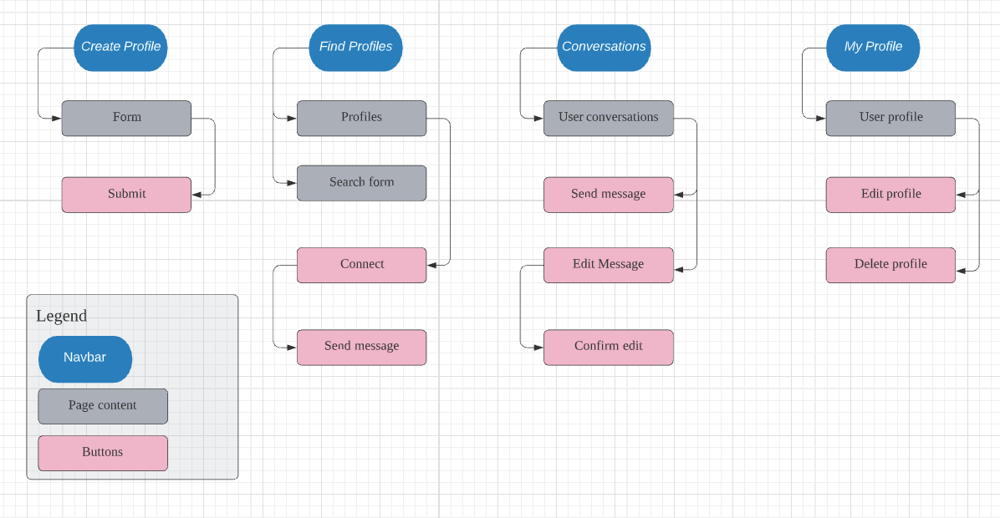
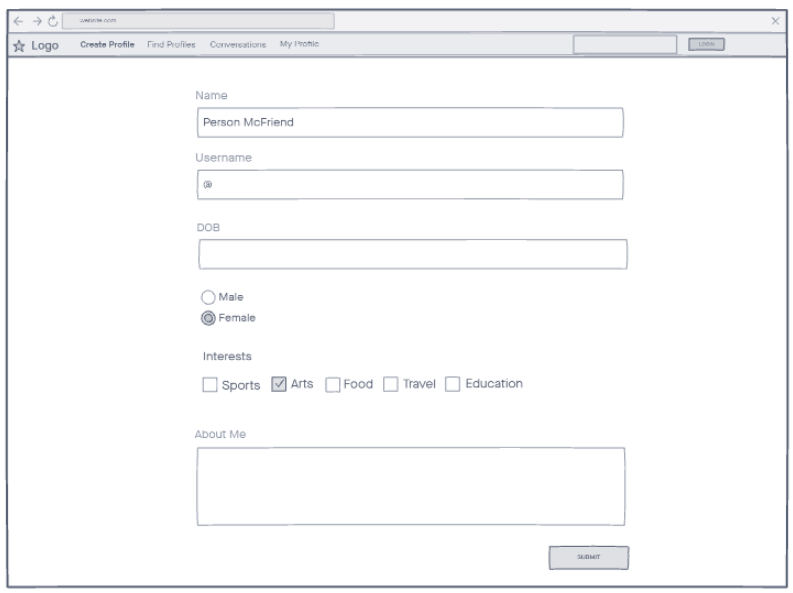
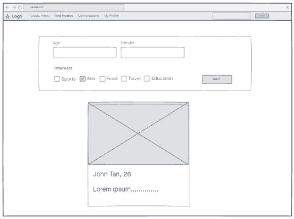
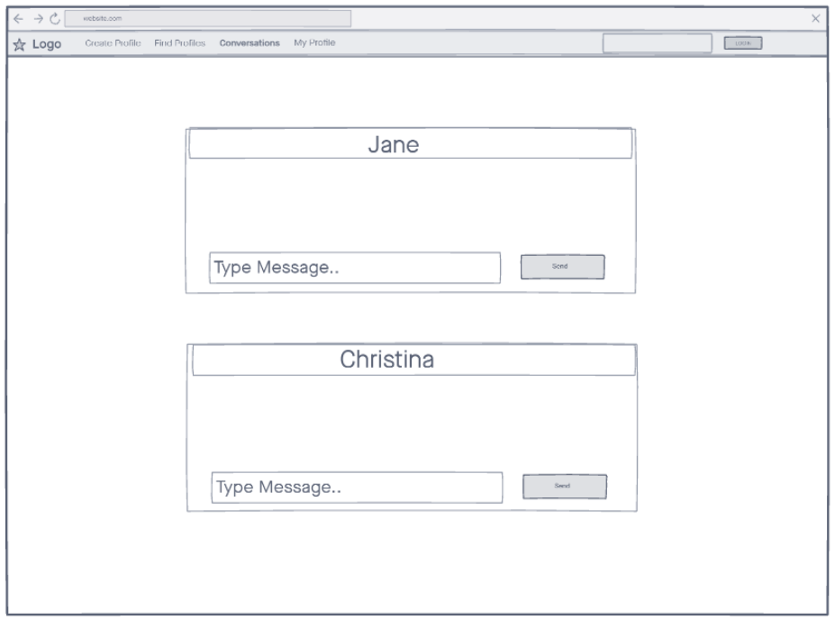
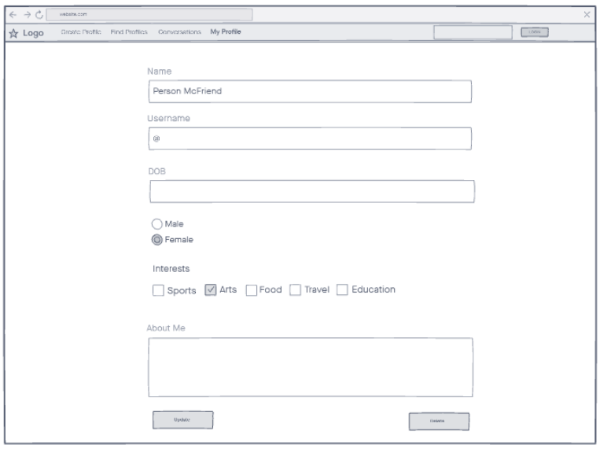

Live URL: https://adoring-kowalevski-e658fa.netlify.app/

# MatchMade Dating

## Site owner goals

MatchMade Dating is a dating app for singles looking to build new genuine relationships and ultimately find their lifelong partner. The goal of this app is to bring together people with this same goal.

With the world going digital along with the Coronavirus pandemic which drove many to live online, there is an increasing need to shift the way we build connections with people. With MatchMade dating, users are able to reach out to other users who are similar to them and find opportunities to take their relationships further.

Data collected from users such as their interests and age can be sold.

## Project Complexity

## User Stories
1. As a user, I want a platform for meeting people with the same goal as me which in this case, is finding a partner who has similar interests as me and whom I can get along with.
Acceptance criteria: The app should take in user information and display them on profiles for other users to find.

 2. As a user, I want a safe place to have conversations with the people I connected with.
 Acceptance criteria: The app should have a chat which allows users to talk within a safe environment without having to share private information.

 ## Scope
 ### Functional
 1. User can create a profile to start connecting with others on the app.
 2. Users can find profiles and filter search results based on personal preference.
 3. Users can connect with anyone and start chatting with them on the app.
 4. Users can go back to view old and existing conversations they had.
 5. Users can update their profile information.

 ### Non-Functional
 1. Confidential information such as passwords are kept separate from other data provided by users.

 ## Structure

### Information Architecture
#### Content Inventory
1. Name, age, interest categories, photo and introduction write-up is displayed on user profiles.
2. Old and existing conversations with name of conversing partner and messages sent. 

#### Interaction Design
1. Understandability: Profile content are presented on cards with consistent layouts and forms have clear input titles.
2. Learnability: Navigation links are positioned at the top where users are familiar with and are consistent throughout the pages. Cursors and font color changes on links on hover to indicate that it is clickable.
3 Operability:
* Links on navbar are working
* Forms are working and display an error message when submission fails
* Links that requires user sign-up display an alert message when user is not logged in
4. Attractiveness:
* Padding and margin are present to improve readability
* Layouts make best use of device user is on

## Skeleton
### Create Profile

### Find Profiles

### Conversations

### My Profile

## Surface
### Visual Design
* Theme colours chosen for the app(shades of red) to match the context that the app is based on that is, finding love
* 2 hands in the logo design signifies 2 people reaching out to each other
* Font chosen is readable

## Features
### Create Profile
Users can create a profile that will be displayed on the app for other users to find. Unique usernames will be used as verification purposes to use other features in the app and is limited in terms of security.

### Find profiles
Users are able to view all profiles and filter search results based on age, gender and interests and country. Demonstration for combining search queries with 'country' has been ommitted as demonstration has been done on others.

### Conversations
Users are able to connect with other users through their profiles and start a chat with them. Chat is limited in that users are required to exit and go into conversations again upon sending a message in order to view the updated chat.

## Technologies
[Gitpod](www.gitpod.io) was the coding platform used.  

[GitHub](github.com) was used for repositories.  

[Bootstrap 5](https://getbootstrap.com/docs/5.0/getting-started/introduction/) was used for navbar and CSS in margins/padding.  

[Reactstrap](https://reactstrap.github.io/components/form/) input,label,row,col were used for forms.

[Lucid](lucid.app) was used for drawing structure.  

[InVision](invisionapp.com) was used for drawing skeleton.  

[Canva](www.canva.com) was used for creating the logo.  

[Google fonts](https://fonts.google.com/) was used to import fonts.  

## Testing

1. Test that user can create a profile
a. Click on 'Create Profile' at the top
b. Enter all inputs
c. Error message will display under username to inform user when username is invalid or taken
d. Click 'submit'
d. Alert should inform user of successful creation of profile
d. User profile will be displayed in 'Find Profiles'

2. Test user entering an invalid username on login
a. Enter a wrong username 
b. Alert should inform user that user is not found

3. Test chat simulation
a. Create profile, login with unique username and click on 'Find Profiles'
b. Select a profile and click connect
c. Enter a message and sending
d. Click on 'COnversations'
e. Conversation will be displayed

4. Test edit messages
a. Following test case 3, click on pencil icon to the right of a message to edit
b. Enter new message below and click on tick icon to the right of the input textbox
c. Click out of 'Conversations' and click in again
d. Message should be edited

5. Test update profile
a. Login with unique username
b. Click on 'My Profile'
c. Edit any input 
d. Update
e. Alert will inform user upon successful update

6. Test delete profile
a. Following test case 4, click 'delete'
b. Alert will confirm if user wants to delete
c. Click 'ok'
d. User should no longer see their profile or login with old username

7. Test search bar
a. Click on 'Find Profiles'
b. Select filters and click 'search'
c. Filtered profiles should display below

## Deployment
Hosting Platform: Netlify
1. 'npm run build' from terminal
2. Downloaded build folder
3. Unzip folder
4. Go to 'sites' on Netlify
5. Dragged and dropped folder in to deploy

Database platform: Mongodb and deployed to Heroku

Dependencies:
* Axios
* Reactstrap
* Bootstrap

## Credits
[Paul's Github](https://github.com/kunxin-chor?tab=repositories) was used as reference to recreate code that has been taught in class.

[Javatpoint](https://www.javatpoint.com/calculate-age-using-javascript) was used as reference for code to calculate age.

[Unsplash](https://unsplash.com/) was my source of all profile images.

[Zoosk](https://www.zoosk.com/date-mix/online-dating-advice/dating-profile-examples-popular-apps/) was my sourse of sample dating profile examples.
 